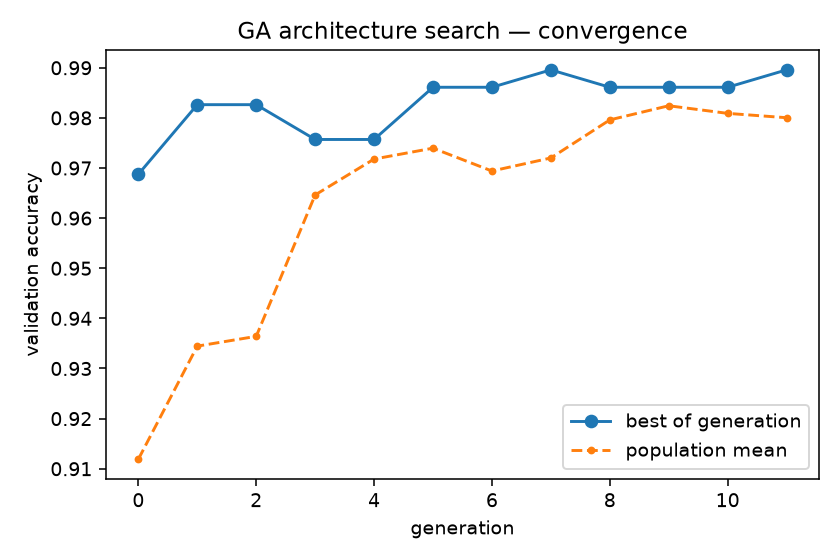
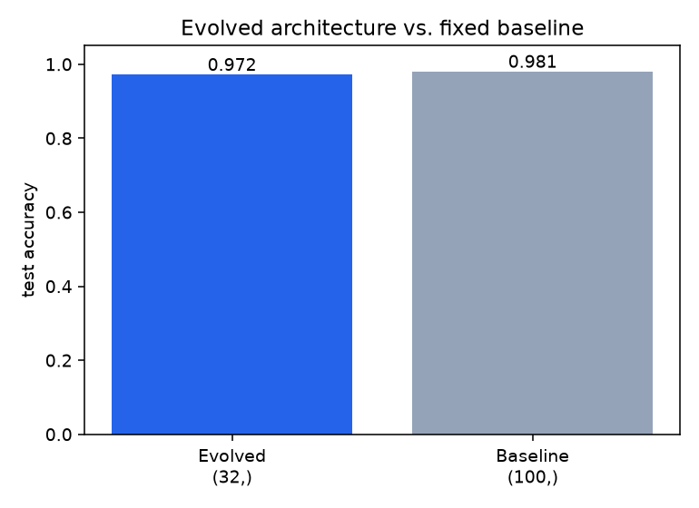
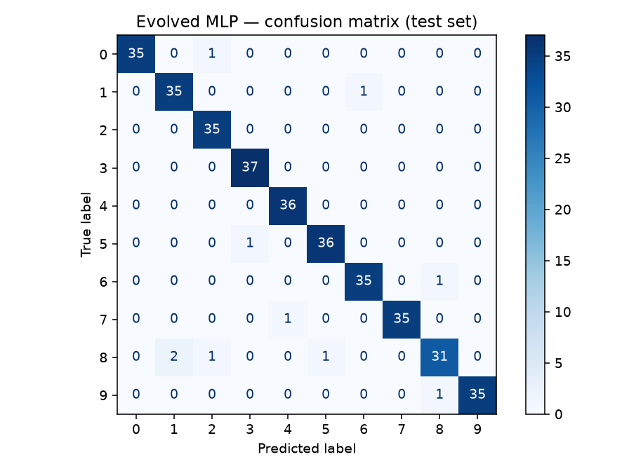
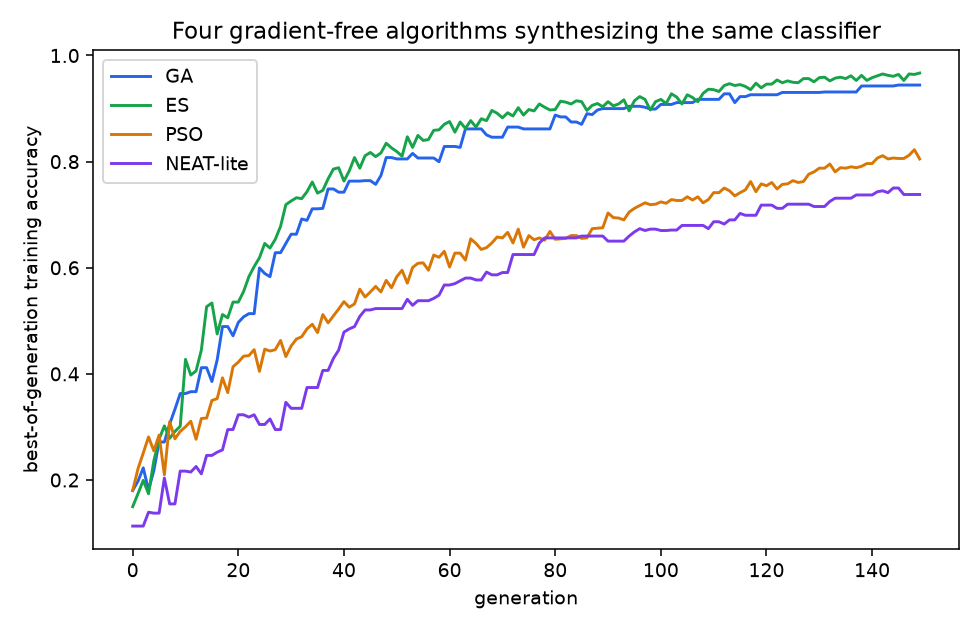
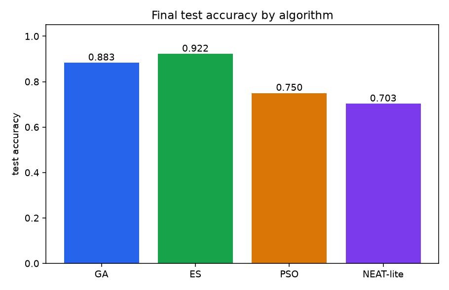
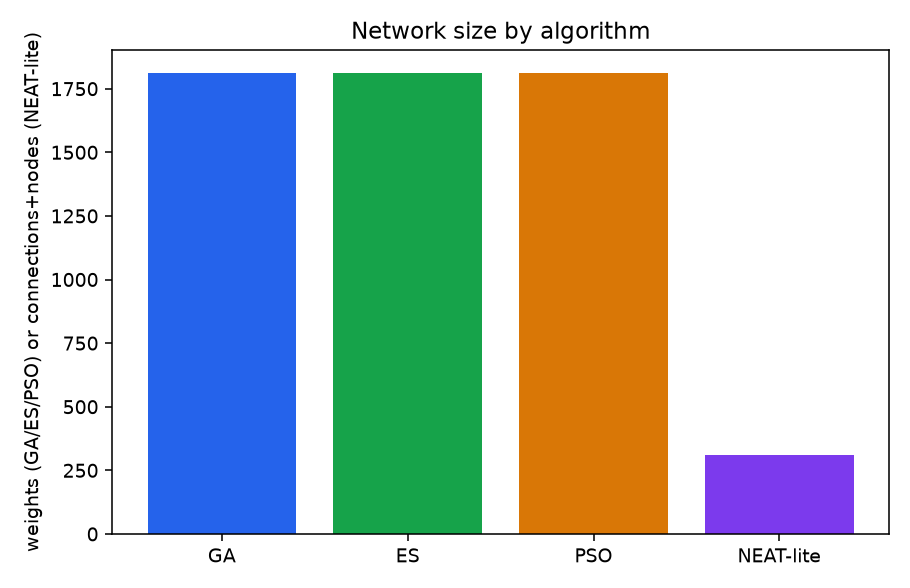
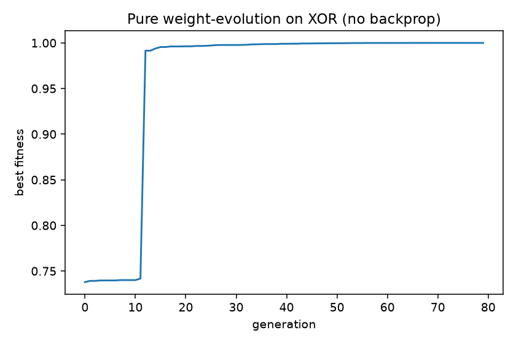

# Evolutionary ANN Synthesis

Three demonstrations of using **population-based, gradient-free search to
build neural networks instead of (or alongside) backpropagation**:

1. **Architecture search** — a GA evolves an MLP's topology and
   hyperparameters (layer sizes, activation, L2 strength, learning rate)
   for a handwritten-digit classifier; each candidate is still trained by
   ordinary backprop, but the GA is what decides *what* to train.
2. **Four algorithms, head-to-head, zero backprop** — GA, ES (evolution
   strategy), PSO (particle swarm), and NEAT-lite (topology + weight
   co-evolution) all synthesize a digit classifier directly — no gradient
   descent anywhere — under the same population/generation budget, so their
   results are directly comparable.
3. **Pure weight evolution on XOR** — the smallest possible version of #2:
   a fixed network, weights as the genome, solved with zero gradient steps.

**Stack:** Python · scikit-learn · NumPy · Streamlit (custom from-scratch algorithms — no NEAT/DEAP/pyswarms dependency)

🔗 **Live demo:** _deployed on Streamlit Community Cloud_ — see [Deployment](#deployment)

---

## 1. Architecture search (neuroevolution of design)

### Problem

Find a compact, accurate MLP for the [scikit-learn `digits`
dataset](https://scikit-learn.org/stable/datasets/toy_dataset.html#digits-dataset)
(1,797 8×8 handwritten-digit images, 10 classes) — without hand-picking the
architecture.

### Approach

| Stage | What happens |
|-------|--------------|
| **Genome** (`src/ga_search.py`) | 1–3 hidden layers (sizes from {8,16,32,64,128}), activation (relu/tanh/logistic), L2 `alpha`, `learning_rate_init` |
| **Fitness** | validation accuracy of an MLP trained with that genome, minus a small penalty on total parameter count (so compactness breaks near-ties) |
| **Selection** | tournament (k=3) |
| **Crossover** | gene-wise uniform crossover — every child is a structurally valid genome, nothing to repair |
| **Mutation** | resize/add/remove a layer, swap activation, perturb `alpha`/learning rate — each gene independently, rate 0.3 |
| **Search budget** | population 16 × 12 generations, each candidate trained for 150 iterations on a held-out validation split (~50–75s total) |
| **Final step** | retrain the winning genome (and a fixed baseline) to convergence (400 iterations) on the full training set, evaluate both on a held-out test set |

### Results (held-out test set, n = 360)

| Model | Architecture | Parameters | Test accuracy |
|---|---|---:|:---:|
| Baseline MLP (fixed) | `(100,)` | 7,510 | **0.981** |
| **GA-evolved MLP** | `(32,)`, tanh | **2,410** | 0.972 |

The GA converged on a single 32-unit hidden layer with `tanh` activation —
**3.1× fewer parameters** than the hand-picked 100-unit baseline, within
**0.84 points** of its accuracy. It found this by generation 5 of 12 (see
convergence plot) and spent the rest of the search confirming nothing
smaller/better was reachable from there.

<p align="center">
  
  
</p>
<p align="center">
  
</p>

## 2. Four algorithms head-to-head, zero backprop (`src/evo_algorithms.py`, `src/compare_evolution.py`)

### Problem

Same digit classifier as above, but this time **no backprop anywhere** —
each algorithm searches the network's weights (or, for NEAT-lite, weights
*and* topology) directly. GA, ES and PSO all optimize a flat weight vector
for the same fixed `(64, 24, 10)` architecture, so their results are
directly comparable; NEAT-lite discovers its own architecture, so its final
network size is itself one of the results.

### The four algorithms

| | Selection/update | Crossover | Notes |
|---|---|---|---|
| **GA** | tournament (k=3) | real-coded BLX-α blend crossover + Gaussian mutation | the classic "population + crossover + mutation" recipe |
| **ES** | `(μ/μ, λ)` — top-μ weighted recombination | none | mutation strength `σ` self-adapts via a log-normal draw each generation |
| **PSO** | none — no selection or offspring at all | n/a | each particle just moves toward its own best-ever position and the swarm's best; not "evolutionary" in the Darwinian sense, but the standard companion algorithm here |
| **NEAT-lite** | tournament (k=2), light elitism | none (mutation-only) | genomes start as a plain input→output linear model and grow hidden nodes/connections via structural mutation |

All four run for the **same** population (120) × generations (150) budget
on the same train/val/test split (see [`src/evo_algorithms.py`](src/evo_algorithms.py)
for the full operator definitions).

### Results (held-out test set, n = 360)

| Algorithm | Test accuracy | Network size | Wall-clock |
|---|:---:|---:|---:|
| **ES** | **0.922** | 1,810 weights | 4.8s |
| GA | 0.883 | 1,810 weights | 5.5s |
| PSO | 0.750 | 1,810 weights | 4.9s |
| NEAT-lite | 0.703 | **309** (1 hidden node, 308 connections) | 17.0s |

<p align="center"></p>
<p align="center">
  
  
</p>

**Reading the result:** ES beats plain GA, which beats PSO, on a smooth
~1,800-dimensional continuous landscape — matching the textbook expectation
that ES's self-adaptive step size and weighted recombination are
purpose-built for exactly this kind of problem, while a discrete-heritage
GA needs a real-coded crossover operator to be competitive at all — an
early version of this GA used discrete gene-swap crossover (copy each gene
whole from one parent or the other) and scored only 0.42; switching to
BLX-α blend crossover (interpolating between parents, not just picking one)
lifted it to 0.883. NEAT-lite trades accuracy for a network **~6× smaller**
than the other three, and its convergence curve is still climbing when the
shared generation budget runs out: growing structure from nothing is a
harder search than tuning weights for a size you were handed, and real NEAT
uses speciation (not implemented here — see [Notes](#notes--limitations))
to protect new structure long enough to be worth the wait.

## 3. Pure weight evolution — XOR, zero backprop (`src/neuroevolution_xor.py`)

A separate, much smaller demo: a fixed 2→4→1 network (17 weights total)
whose **weight vector is the genome**. There is no gradient descent
anywhere — fitness is classification accuracy on XOR, and evolution
(elitism + uniform crossover + Gaussian mutation) is the *only* optimizer.

```
gen   0  best_fitness=0.7379
gen  20  best_fitness=0.9962
gen  79  best_fitness=1.0000

final predictions on XOR:
  [0.0, 0.0] -> 0.008 (target 0)
  [0.0, 1.0] -> 0.998 (target 1)
  [1.0, 0.0] -> 0.985 (target 1)
  [1.0, 1.0] -> 0.013 (target 0)

accuracy: 100%  (17 weights evolved, zero gradient steps)
```

<p align="center"></p>

## Run it locally

```bash
python -m venv .venv && source .venv/bin/activate
pip install -r requirements.txt

python src/train.py                 # architecture-search GA + retrain + baseline (~1 min)
python src/compare_evolution.py     # GA vs ES vs PSO vs NEAT-lite, no backprop (~35s)
python src/neuroevolution_xor.py    # weight-evolution XOR bonus demo (~seconds)

streamlit run app/streamlit_app.py
```

## Deployment

The trained models (`models/*.joblib`) and report figures/metrics are
committed, so the Streamlit app runs with no training step. To deploy:

1. Push this repo to GitHub.
2. On [share.streamlit.io](https://share.streamlit.io) → **New app** → point at
   this repo, main file `app/streamlit_app.py`.

## Project layout

```
src/ga_search.py            genome encoding + GA operators + fitness (architecture search)
src/train.py                 runs the search, retrains winner + baseline, writes models/figures
src/evo_algorithms.py        GA / ES / PSO / NEAT-lite implementations (no backprop)
src/compare_evolution.py     runs all four head-to-head, writes comparison figures/JSON
src/neuroevolution_xor.py    standalone weight-evolution demo (no backprop)
app/streamlit_app.py         interactive demo: 3 tabs, one per section above
models/ reports/             trained models + metrics + figures (tracked)
```

## Notes & limitations

- Educational project on a small, clean dataset — every algorithm is
  implemented from scratch (rather than a library like NEAT/DEAP/pyswarms)
  to keep the selection/mutation/recombination mechanics visible and easy
  to read.
- The GA architecture search (§1) searches a modest space (1–3 layers, 5
  layer-size choices, 3 activations) that runs in about a minute on a
  laptop; a larger search space would need a bigger population/generation
  budget or parallel fitness evaluation to stay fast.
- NEAT-lite (§2) is deliberately a simplified NEAT: mutation-only (no
  crossover — matching genomes by innovation number for crossover is the
  most complex part of full NEAT), and no speciation (real NEAT protects a
  newly-mutated topology from competing against fully-optimized peers for
  several generations before being judged on fitness alone). Without that
  protection, structural mutations here have to win a fitness fight
  immediately, which is the main reason it's still improving when the
  shared generation budget runs out in §2's results.
- "Neuroevolution"/"evolutionary" covers a few different things on purpose
  in this project — evolving *architecture* trained by backprop
  (`ga_search.py`), evolving *weights or weights-and-topology* with zero
  backprop (`evo_algorithms.py`), and PSO, which isn't Darwinian evolution
  at all (no selection, no offspring) but is included as the standard
  companion metaheuristic. The README and code comments call out which is
  which throughout rather than blurring the distinction.
